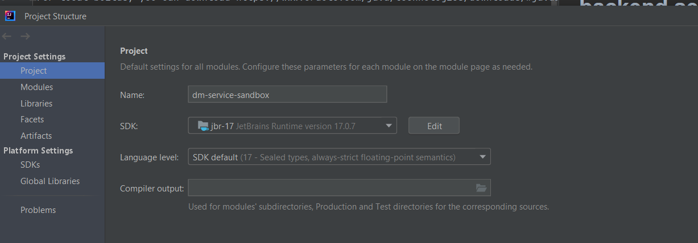
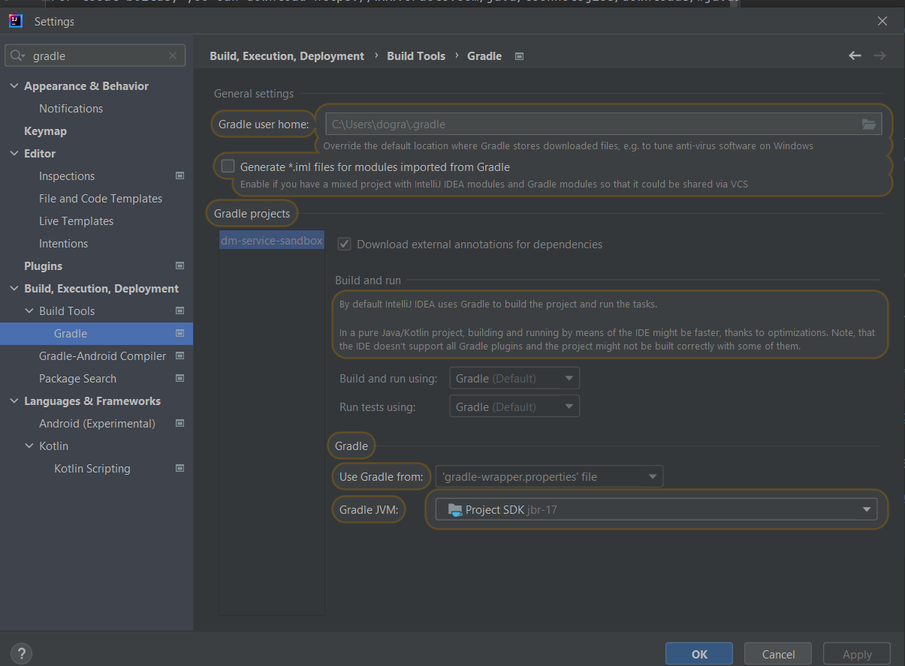

# The Project will have the backend services for the DM

## Building blocks for the services
### JDK 17
For local builds, you can download https://www.oracle.com/java/technologies/downloads/#java17 to use
### Gradle 8
### Spring Boot Web Rest API

### Design dashboard link
[Work in Progress]
https://www.figma.com/file/3ovhj2RQ5dQEP9ZlSM9F0T/Morgan-Stanley?type=design&node-id=0%3A1&mode=design&t=iN78xtKj98J6UoY3-1

### More about digital moment
https://digitalmoment.org/

### Launching the code locally
1) Click on build.gradle to run and load all dependencies
2) Ensure JDK 17 is installed and added in your Intellij
a. File-> Project Structure -> Project
Add SDK JDK 17

b. File -> Settings

3) Build the project
4) Once the project compiles - click on class DmServiceSandboxApplication to launch as Spring boot application
5) The services will be hosted on http://localhost:8080/
sample url:
   http://localhost:8080/v1/user/ping

### Swagger url
Once you launch the application locally, swagger url can be accessed at:
http://localhost:8080/swagger-ui/index.html#/

#### API Docs link:
http://localhost:8080/api-docs